# ShopSphere Customer Intelligence System — Final Report

**Retention, Value and Experimentation**

Data window: 2024-06 – 2026-06
Generated: 2026-07-11
Headline KPIs queried live from the MySQL gold layer. Model metrics quote the validated notebooks.
All data is synthetic, calibrated to 2026 industry benchmarks.

Full PDF: [`reports/shopsphere_final_report.pdf`](./reports/shopsphere_final_report.pdf)

---

## Executive Summary

ShopSphere is a synthetic-but-realistic online retailer analyzed end-to-end: 24 months, 12,000 customers, ~2.36M rows through a bronze → silver → gold MySQL warehouse. The central finding: 69.2% of buyers never purchase a second time, and the highest-leverage actions all attack that number.

| KPI | Value | KPI | Value |
|---|---|---|---|
| Total completed revenue | $1,664,813.13 | One-time buyer rate | 69.2% |
| Completed orders | 17,811 | Cart abandonment | 70.6% |
| Average order value | $93.96 | Top-20% buyers' revenue share | 56.9% |
| Unique buyers | 11,323 | Blended paid CAC | $73.89 |
| NPS (response-weighted) | 45.5 | A/B free-shipping lift | +15.1% (p = 7.9e-04) |

Top recommendations (detail in Section 6): roll out the free-shipping threshold (+15.1% conversion, p = 7.9e-04); run a second-purchase program for the 70% one-time buyers; win back the Hibernating segment (30% of buyers, 18% of revenue); protect Champions (4% of buyers, 12% of revenue).

---

## 1. Data Foundation — Trust Before Analysis

Every number in this report sits on a verified pipeline.

- **Seeded generation.** 8 behavioral realism rules (Pareto concentration, repeat-purchase ladder, funnel decay, channel economics, seasonality, price-elastic baskets, satisfaction–loyalty link, a real A/B effect). A calibration gate fails the build if any of 8 checks drifts from its industry band: **8/8 PASS**.
- **Deliberate dirt, graded cleaning.** 9 defect classes injected with a ground-truth manifest; the bronze → silver cleaning pipeline was graded against it: **9/9 caught (PERFECT)**. 2,362,710 bronze rows → 2,362,203 silver rows, e.g. 290 duplicate orders removed (19,687 → 19,397).
- **SQL gold layer.** 12 views (KPIs, window functions, cohort retention). Gate vs. independent pandas recomputation: **5/5 PASS**, cohort matrix exact in 267/267 cells.

## 2. Business Health

Revenue grows steadily with a 1.40× Nov–Dec seasonal peak; the final month's jump is the growth curve's in-month ramp, not an anomaly. AOV averages $93.96 across 17,811 completed orders.

  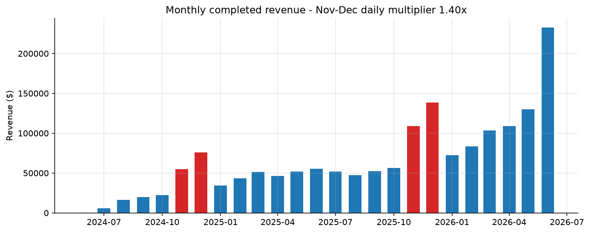
  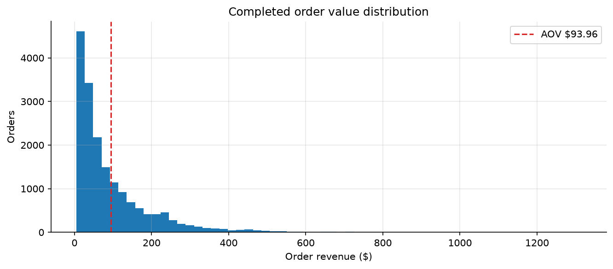

The funnel loses **70.6%** of carts before checkout, the single largest recoverable revenue pool. On the acquisition side, blended paid CAC is **$73.89**, with email converting ~3x paid social.

  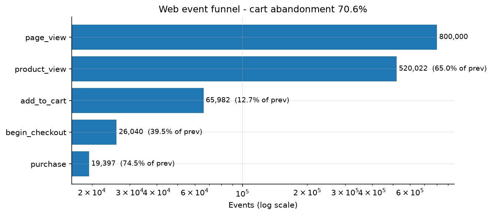
  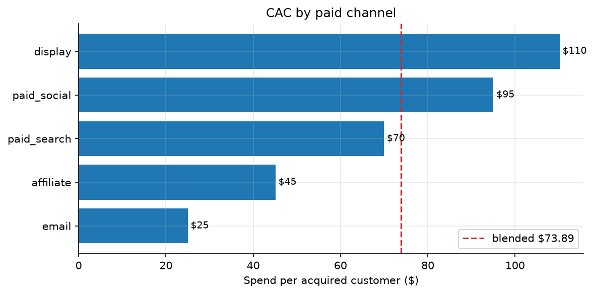

## 3. Who the Customers Are

Revenue is concentrated: the top 20% of buyers contribute 56.9% of revenue, and 69.2% of buyers purchased exactly once. The repeat-purchase ladder confirms the classic pattern — the hardest step is first → second order; each later step retains more.

  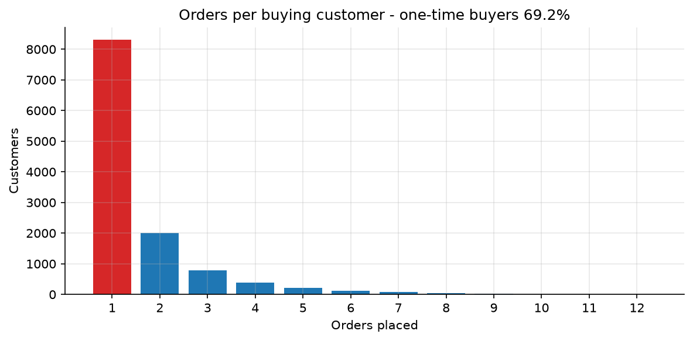
  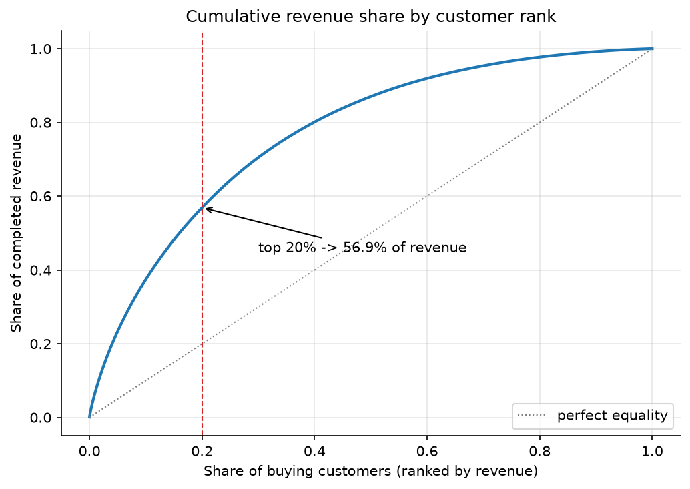

**RFM segmentation** (11,323 buyers, 9 segments): Champions are 4% of buyers but 12% of revenue (avg $487 vs. $147 overall). Hibernating is the largest segment at 30% of buyers, holding 18% of historic revenue — the natural win-back target.

  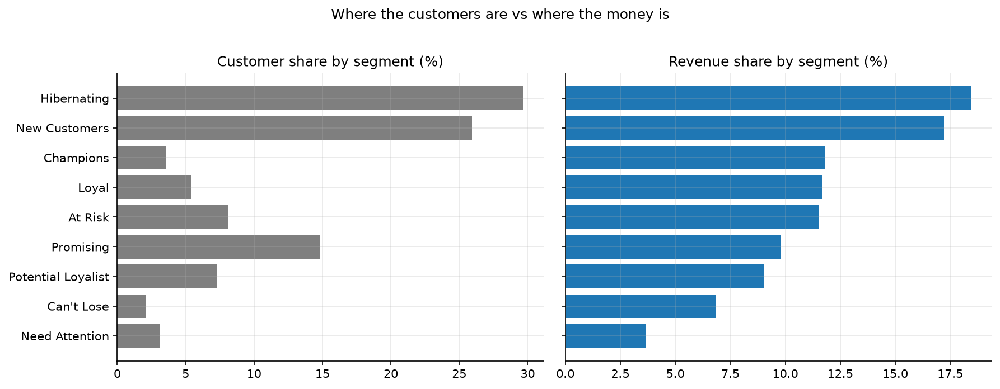
  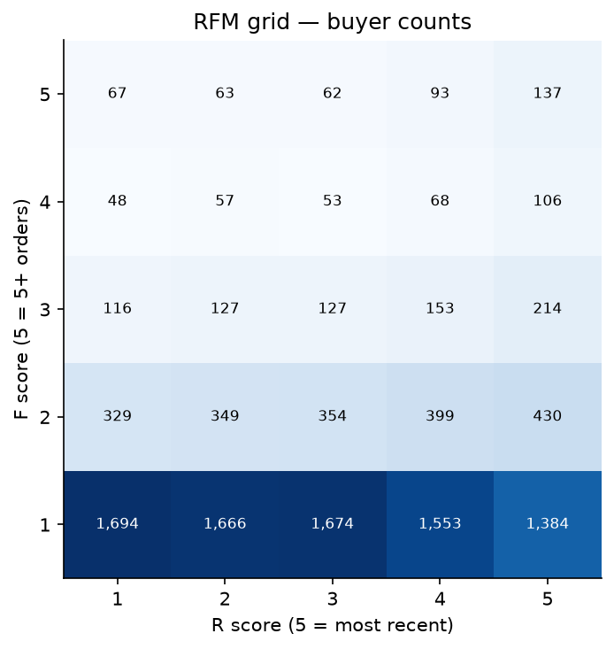

  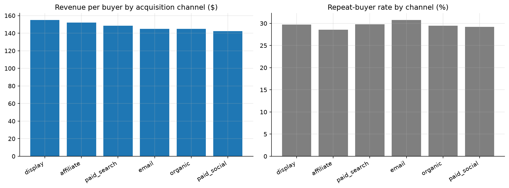
  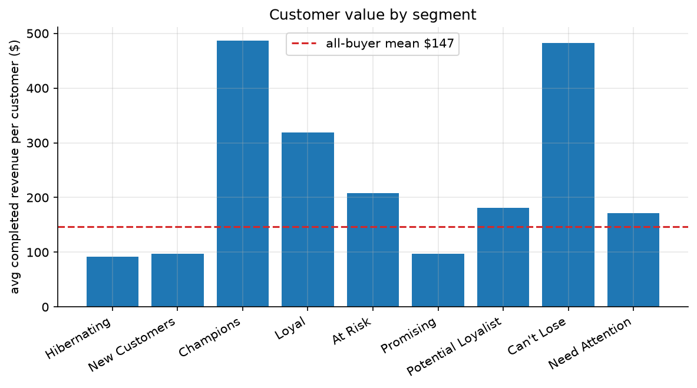

## 4. Value & Risk — CLV and Churn

A BG/NBD + Gamma-Gamma model (implemented on scipy, validated by a 26-week time-split backtest: predicted/actual repeat purchases = 1.06) projects **$282,875** of 12-month CLV across the base, mean $25.09 per buyer, with the top decile holding 38.2% of it. Future 12-month CLV alone does not repay the $73.89 blended CAC; acquisition must be justified on multi-year value and aimed at high-CLV lookalikes.

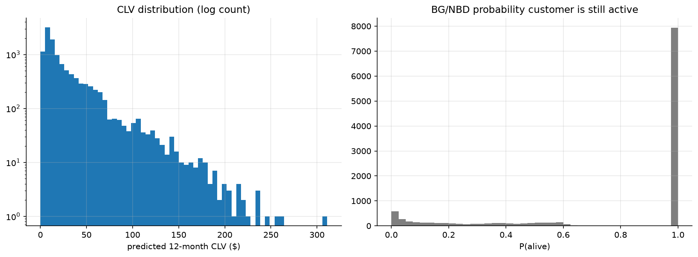

A churn model (26-week holdout, leakage-checked features) reaches **AUC 0.813** against an 89.9% base churn rate, good enough to rank buyers for retention spend, with recency and frequency dominating the signal.

  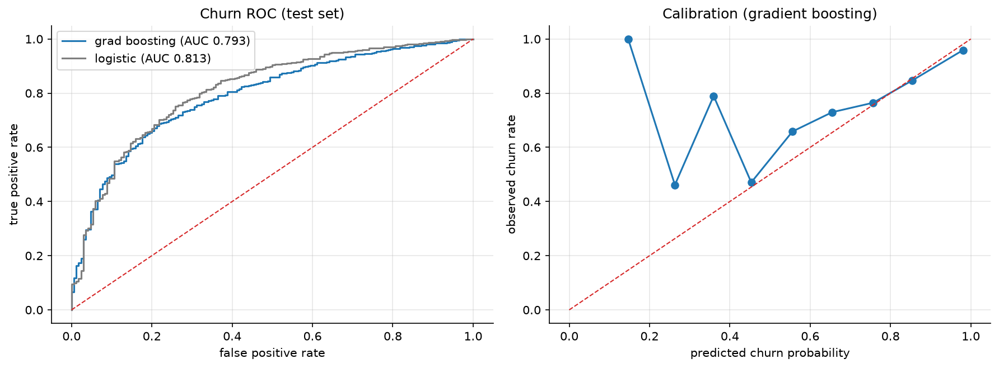
  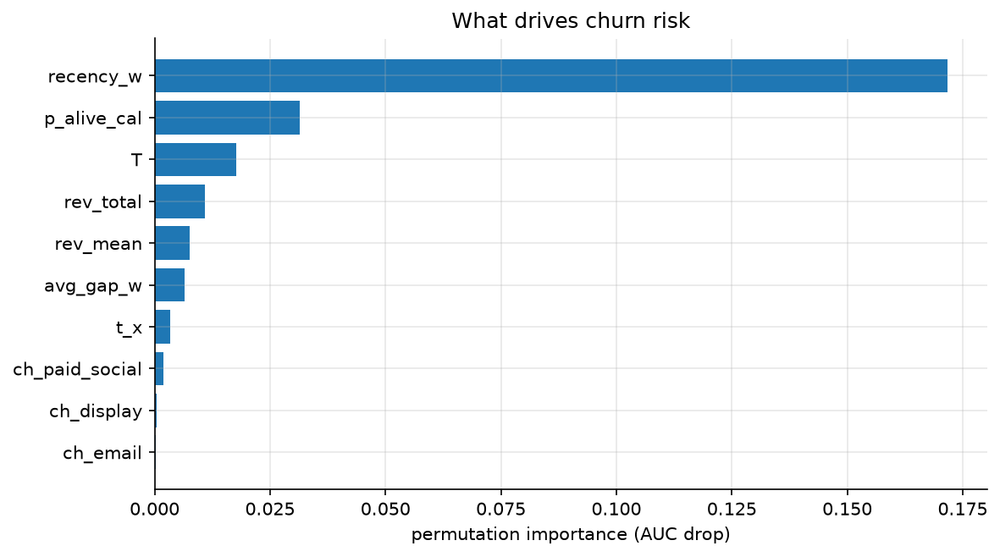

## 5. Experimentation — Free-Shipping Threshold

A 30,000-per-arm A/B test (randomization verified: SRM chi-squared p = 1.0000) raised conversion from 3.43% to 3.95%, a **+15.1% relative lift** (95% CI +6.0% … +24.9%, z = 3.36, p = 7.9e-04), at 91.9% achieved power against a +12.5% design MDE.

  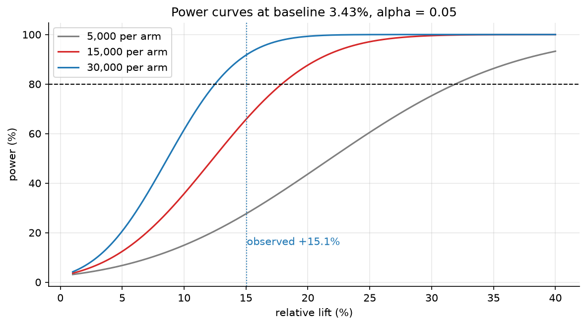
  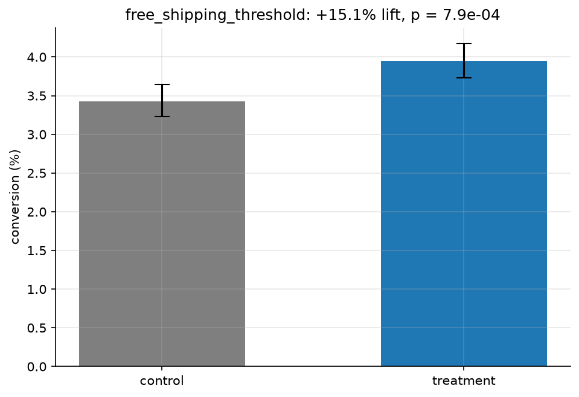

Guardrail: converted-order revenue was $88.80 (treatment) vs. $97.36 (control), Welch p = 0.071, a suggestive but not significant basket shrink. Revenue per assignment still favors treatment ($3.17 vs. $3.00). Recommendation: ship, and monitor basket size in production.

## 6. Recommendations

1. **Roll out the free-shipping threshold to 100% of traffic.** +15.1% conversion at p = 7.9e-04 with power 91.9%; keep the basket-size guardrail on a dashboard (it was suggestive at p = 0.071, not proven).
2. **Stand up a second-purchase program.** 69.2% of buyers stop at one order, and the ladder shows first → second is the hardest step; a post-first-purchase sequence attacks the villain number of this whole analysis.
3. **Win back Hibernating, protect Champions.** Hibernating = 30% of buyers / 18% of revenue (reactivation offers); Champions = 4% / 12% at $487 avg (loyalty perks, no discounting needed).
4. **Target acquisition by CLV, not volume.** Mean 12-month CLV ($25.09) is far below blended paid CAC ($73.89); the top CLV decile holds 38.2% of future value — shift budget toward email/lookalikes of high-CLV profiles and away from the most expensive paid channels.
5. **Attack cart abandonment (70.6%).** The funnel's largest leak; recovery emails and checkout friction reduction are the standard levers, now measurable month-over-month in the gold layer.

## Appendix — Method & Reproducibility

**Stack:** Python (seeded generators, cleaning, scipy/sklearn models) → MySQL 8 medallion warehouse (bronze/silver/gold) → SQL window functions → Excel workbook, Power BI dashboard, this report.

**Determinism:** one seed in `settings.py`; same seed ⇒ byte-identical CSVs.

**Gates (all green at build time):** calibration 8/8, cleaning quality 9/9, gold KPI gate 5/5, Excel workbook gate 5/5, Power BI DAX acceptance 8/8, pytest suite, and this report's own self-validation gate (KPIs re-checked against live SQL after render).

Headline KPIs in this report are queried live from the gold views at build time with the same SQL as the M3 gate; model metrics quote the executed, validated notebooks.

ShopSphere is a synthetic retailer: all data generated, calibrated to 2026 industry benchmarks, and verified by the gates above.

Report built by `python/05_delivery/build_final_report.py`.
